# PlanIt
> Authors: [Ruth Sun](https://github.com/rsun050), [Kenny Thai](https://github.com/kennythai2003), [Jake Blackwell](https://github.com/JakeBlack2003), [Brendan Cheng](https://github.com/bchen203)
## 

## Project Description

> As undergraduate students going into their upper-classmen years, course load is no joke. It is the utmost importance to be organized and have a set schedule. This project is of great significance as it will help us (the creators) and other students to stay on track and fulfill tasks on time in an organized manner. Our project PlanIt's features will include:
> * Task creation
>   * Task information includes: name, date, time, priority, description
> * A UI that displays everything related to the program using C++
> * Terminal commands to manage tasks including:
>   * Displaying tasks
>   * Adding and editing tasks
>   * Deleting tasks
>   * Searching for tasks
>   * Sorting tasks
>   * Help prompts
>   * Saving and quiting for later use

## Class Diagram
 > ### Task Class
 > * Can store, modify, and output information about a task
 >      * Name, description, date, start time, end time, priority
 > ### Date Class
 >   * Stores all values relevant to task dates, including leap years
 >   * Ensures the maximum number of days match the respective month
 >   * Outputs dates in the format: "mm/dd/yyyy"
 > ### Time Class
 >   * Stores time in a 24-hr format
 >   * Outputs times in the format: "hh:mm"
 > ### Debug Class
 >   * Validates user inputs for other classes and corrects them if necessary
 > ### UI Class
>   * Launches the program which will generate the text interface, load the save data (or create a new save file if none exist), and display the tasks
>   * Allows the user to add, edit, delete, search, and sort (by Date or Priority) tasks
>   * Saves the current tasks by writing everything to a text file
>   * The function setSaveFile can be used to modify the name of the save file
  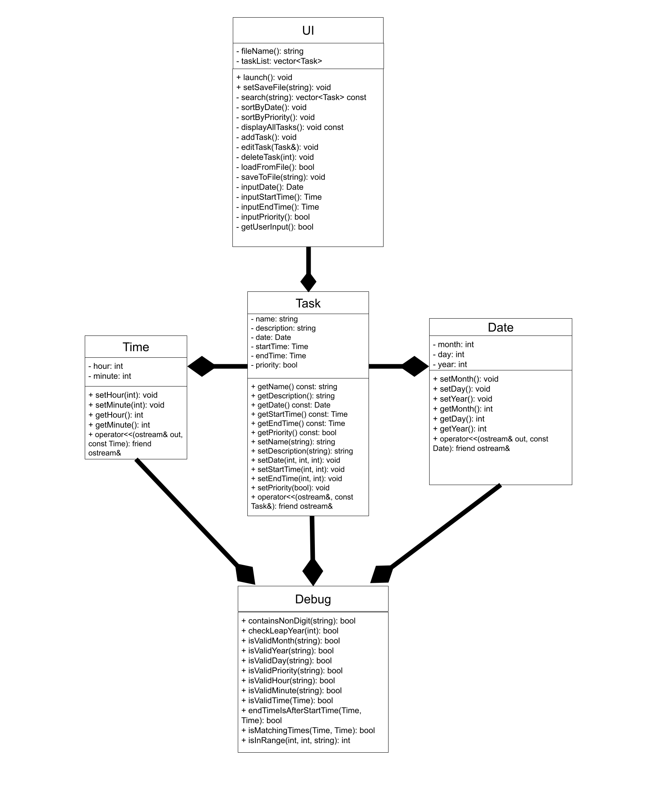
 
 ## Screenshots
  * <b>Opened for the first time</b>
    * 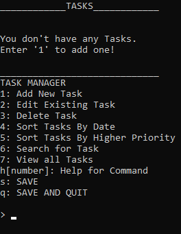
  * <b>Adding, Editing, and Deleting a Task</b>
    * 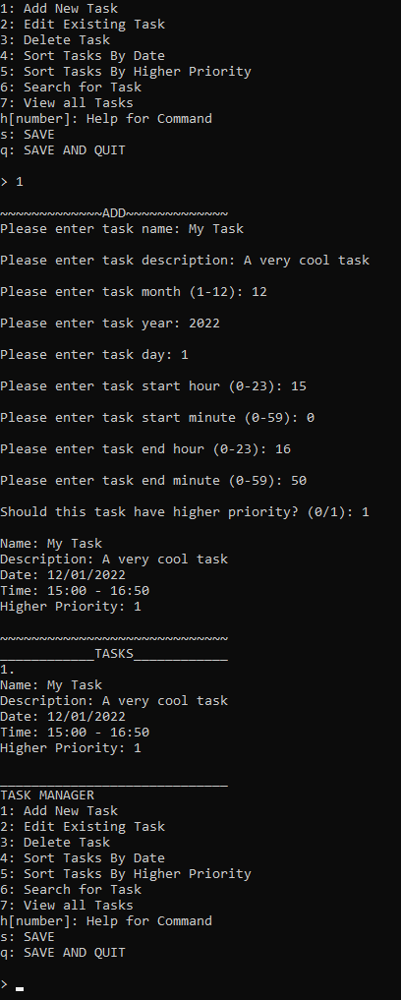   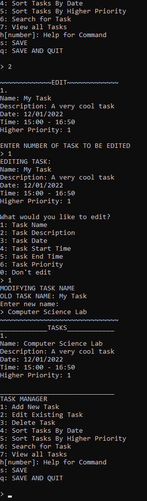   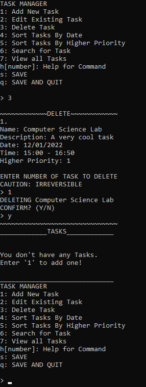
  * <b>Searching and Sorting by Higher Priority</b>
    * 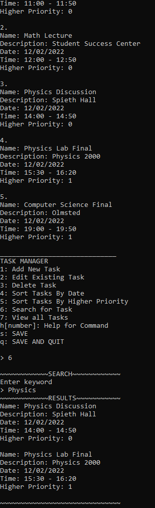   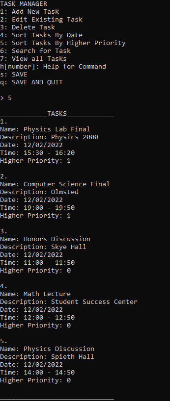

 ## Installation/Usage
 > 1. Open the <b>"Release"</b> folder in the Github
 > 2. Download the <b>"PlanIt.exe"</b> executable located in the folder
 >    * This is our latest version of the application 
 > 3. Know where the executable is located because a <b>"save.txt"</b> file will automatically be created
 >    * The "save.txt" file will store all the tasks you create, so keep the executable and text file in the same directory
 >    * <b>DO NOT</b> edit the "save.txt," as this may result in unknown results and the executable will not be able to run as intended
 > 4. Run the executable
 >    * Make sure no anti-virus blocks the program (it is not a virus)
 > 5. Follow the instructions on screen, and use the help command to see how to use all of the features!

 ## Testing
 > * Alongside our own testing, several users were given the program at different points in development to find errors in the program, resulting in a robust final product
 > * Every user input goes through extensive testing to ensure that the right command was entered
 >    * If an incorrect input is given, the program will ask for a new input until it is correct
 > * All dates and times provided by the user will go through individual tests to confirm that they are accurate
 >    * Ex. 2/29/2023 is an invalid date, so the program will make sure the user cannot input that date unless the year is a leap year
 >    * If an end time takes place before the start time, it will be interpreted as a time on the following day
 >    * If an end time matches the start time, only one time will be displayed under that task
 
 * Tests for Task Class:
  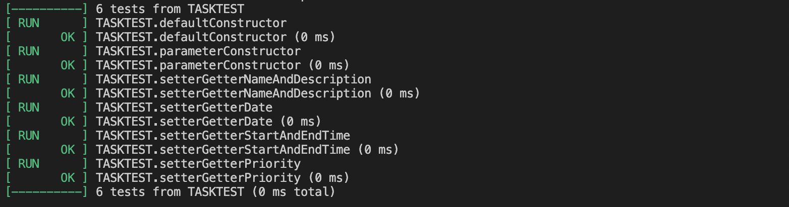
 * Tests for Date Class:
  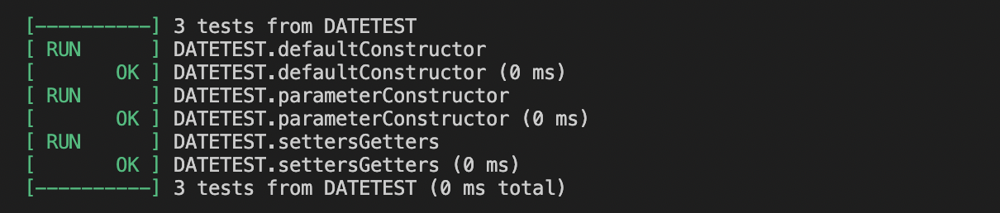
 * Tests for Time Class:
  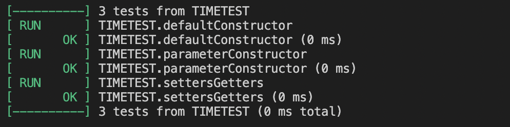
 * Tests for Debug Class:
  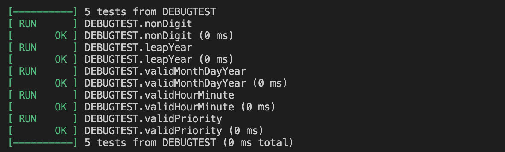
 
